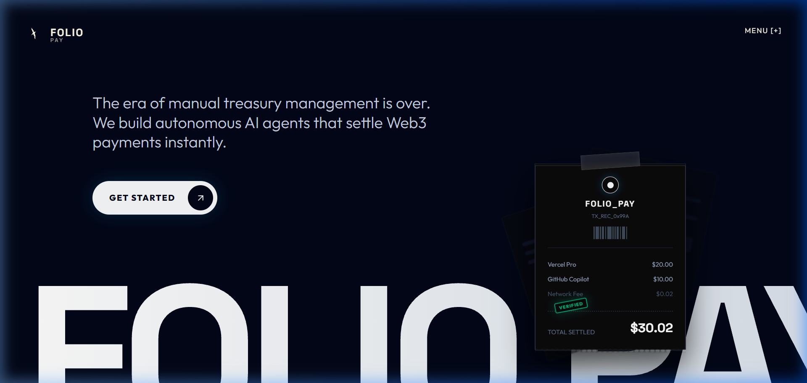
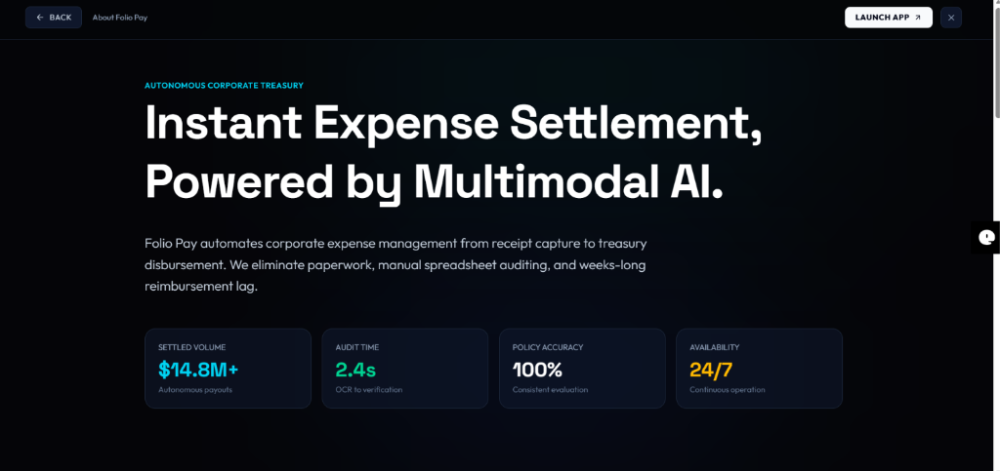
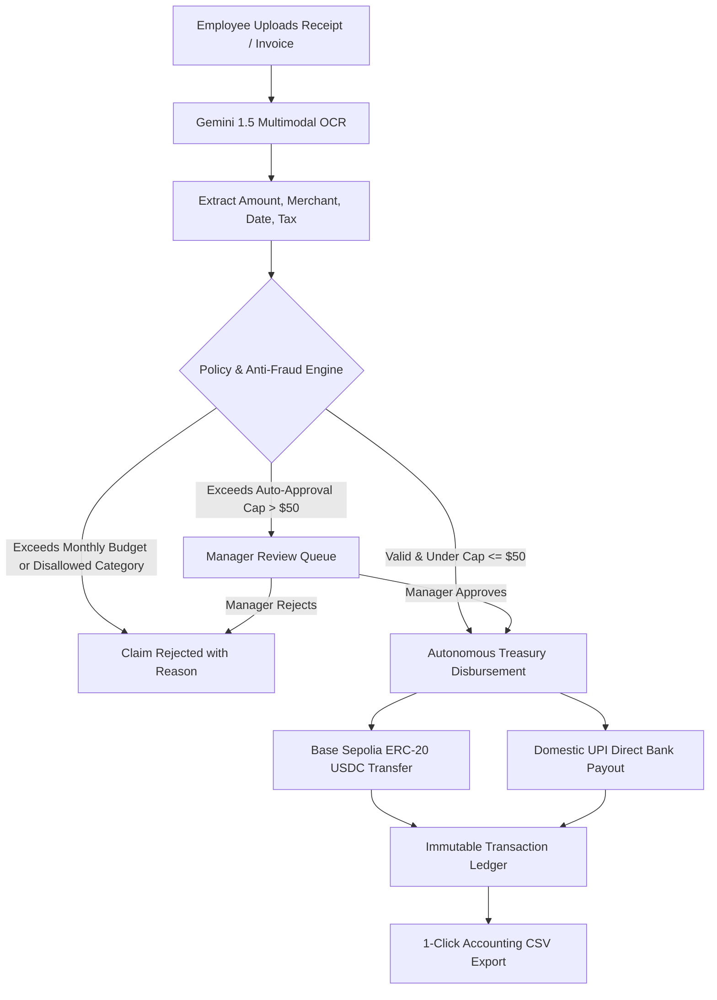

# Folio Pay

Autonomous corporate treasury and instant expense reimbursement protocol powered by multimodal AI and programmable smart contract execution.



---

## Overview

Traditional expense reimbursement is fundamentally broken. Employees pay out-of-pocket for company operations, collect paper receipts, and wait 14 to 45 business days for manual spreadsheet verification and payroll cycles.

**Folio Pay replaces this bureaucracy with deterministic automation:**
1. Employees upload raw receipts or invoice PDFs.
2. Google Gemini 1.5 Vision extracts vendor names, line items, dates, and currency in under a second.
3. Policy rules (monthly limits, single-claim caps, category whitelists) evaluate the claim instantly.
4. Approved claims under threshold ($50) disburse autonomously straight to the employee via **Base Sepolia USDC** or instant UPI transfers. Over-limit claims route to a rapid manager approval queue.



---

## Execution Flowchart



---

## Architecture & Tech Stack

### Frontend
- **Framework**: React 19 + Vite
- **Styling**: Tailwind CSS v4 + Custom Glassmorphism
- **Animations**: GSAP 3 (stagger timelines, counter tweens, 3D card tilt)
- **Smooth Scroll**: Lenis + GSAP ScrollTrigger
- **Icons**: Lucide React

### Backend
- **Framework**: FastAPI (Python 3.9+)
- **Multimodal AI**: Google Gemini 1.5 Pro / Flash Vision models
- **Web3 Engine**: Web3.py on Base Sepolia testnet
- **Storage**: Workspace-isolated ledger JSON stores and static receipt file storage

---

## How to Run Locally

### Prerequisites
- **Python 3.9+** installed
- **Node.js 18+** and npm installed
- Git

---

### 1. Run the Backend Server

Open a terminal window and run:

```bash
# Navigate to backend directory
cd backend

# Create virtual environment (if not already created)
python -m venv venv

# Activate the virtual environment
# Windows (PowerShell):
.\venv\Scripts\activate
# macOS / Linux:
# source venv/bin/activate

# Install dependencies
pip install -r requirements.txt

# Start the FastAPI server on port 8000
uvicorn main:app --host 127.0.0.1 --port 8000 --reload
```

The backend will be live at `http://127.0.0.1:8000`.

---

### 2. Run the Frontend Dev Server

Open a **second** terminal window and run:

```bash
# Navigate to frontend directory
cd frontend

# Install dependencies (first time only)
npm install

# Start Vite dev server
npm run dev
```

The frontend will be live at `http://localhost:5173`.

---

### 3. Open in Browser & Log In

Open [http://localhost:5173](http://localhost:5173) in your browser:

1. Click **Get Started** or **Menu [+] -> Launch App**.
2. **To enter as Manager (Executive Portal)**:
   - Select the **Manager** tab.
   - Enter a Workspace ID (e.g. `wrk_default`).
   - *Leave private key and Gemini key blank for instant Simulation Mode*, or provide real keys for on-chain execution.
   - Click **Establish Connection**.
3. **To enter as Employee (Expense Hub)**:
   - Select the **Employee** tab.
   - Enter Workspace ID (e.g. `wrk_default`) and your name.
   - Click **Establish Connection**.

> **Note**: You can toggle between **Manager** and **Employee** views on the fly anytime using the `[ Manager | Employee ]` pill toggle in the top navigation header.

---

## Modes of Operation

| Feature | Simulation Mode (Default) | Live Web3 Mode |
| :--- | :--- | :--- |
| **Setup Needed** | Zero setup (leave keys blank) | Private key with Base Sepolia testnet ETH/USDC |
| **AI OCR** | Deterministic heuristics / simulated OCR | Live Gemini 1.5 Vision API parsing |
| **Settlement** | Instant cryptographic mock transaction hashes | Real Base Sepolia on-chain smart contract transfer |
| **Cost** | Free ($0) | Testnet gas only |

---

## Core Capabilities

### Executive Manager Portal
- **Corporate Treasury Vault**: Monitor liquid USDC balance, gas reserves, and monthly budget burn velocity.
- **Rule Governance**: Set monthly team allowances, single-claim caps, and whitelist merchant categories.
- **Pending Approvals Queue**: Review claims flagged for manual inspection with side-by-side receipt image inspection.
- **AI Thought Studio**: Transparent streaming view of multimodal reasoning tokens, detected fraud signals, and compliance verdicts.
- **On-Chain Ledger**: Filter transactions by status and export 1-click accounting CSVs for QuickBooks or Xero.

### Employee Expense Hub
- **Frictionless Submission**: Drag and drop receipt photos or invoices.
- **Auto-Fill OCR**: Real-time extraction of vendor, date, currency, and amount.
- **Instant Status Feedback**: Sub-second feedback on whether the claim was auto-approved or routed to the manager.
- **Personal Reimbursement History**: Real-time ledger of paid claims and pending settlements.

---

## License
MIT License. Built for autonomous financial operations.
