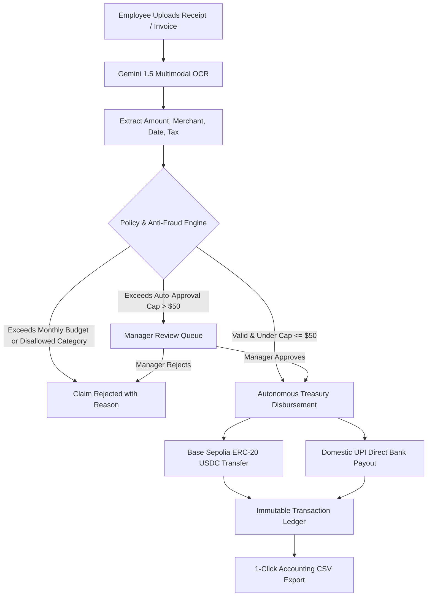

# Folio Pay

Autonomous corporate treasury and instant expense reimbursement protocol powered by multimodal AI and programmable smart contract execution.

---

## Overview
 
Traditional expense reimbursement is fundamentally broken. Employees pay out-of-pocket for company operations, collect paper receipts, and wait 14 to 45 business days for manual spreadsheet verification and payroll cycles.

**Folio Pay replaces this bureaucracy with deterministic automation:**
1. Employees upload raw receipts or invoice PDFs.
2. Google Gemini 1.5 Vision extracts vendor names, line items, dates, and currency in under a second.
3. Policy rules (monthly limits, single-claim caps, category whitelists) evaluate the claim instantly.
4. Approved claims under threshold ($50) disburse autonomously straight to the employee via **Base Sepolia USDC** or instant UPI transfers. Over-limit claims route to a rapid manager approval queue.

---

## Execution Flowchart

```mermaid
flowchart TD
    A[Employee Uploads Receipt / Invoice] --> B[Gemini 1.5 Multimodal OCR]
    B --> C[Extract Amount, Merchant, Date, Tax]
    C --> D{Policy & Anti-Fraud Engine}
    
    D -->|Exceeds Monthly Budget or Disallowed Category| E[Claim Rejected with Reason]
    D -->|Exceeds Auto-Approval Cap > $50| F[Manager Review Queue]
    D -->|Valid & Under Cap <= $50| G[Autonomous Treasury Disbursement]
    
    F -->|Manager Approves| G
    F -->|Manager Rejects| E
    
    G --> H[Base Sepolia ERC-20 USDC Transfer]
    G --> I[Domestic UPI Direct Bank Payout]
    
    H --> J[Immutable Transaction Ledger]
    I --> J
    J --> K[1-Click Accounting CSV Export]
```

---

## Architecture & Tech Stack

### Frontend
- **Framework**: React 19 + Vite
- **Styling**: Tailwind CSS v4 + Custom Glassmorphism
- **Animations**: GSAP 3 (stagger timelines, counter tweens, 3D card tilt)
- **Smooth Scroll**: Lenis + GSAP ScrollTrigger
- **Icons**: Lucide React

### Backend
- **Framework**: FastAPI (Python 3.9+)
- **Multimodal AI**: Google Gemini 1.5 Pro / Flash Vision models
- **Web3 Engine**: Web3.py on Base Sepolia testnet
- **Storage**: Workspace-isolated ledger JSON stores and static receipt file storage

---

